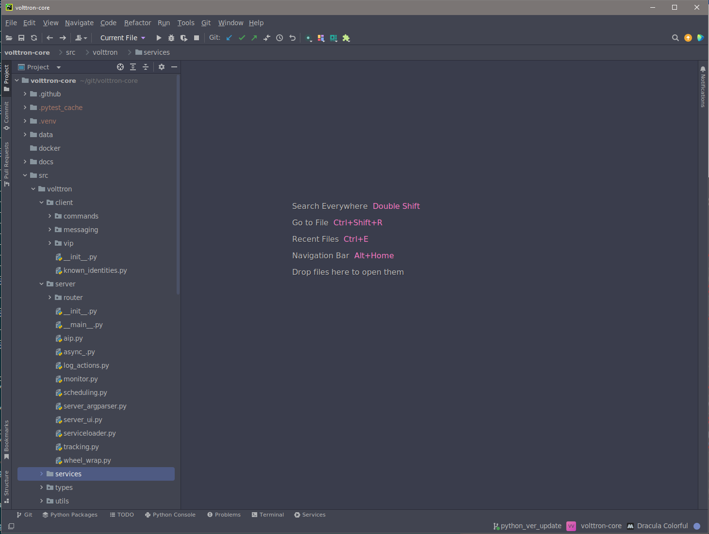
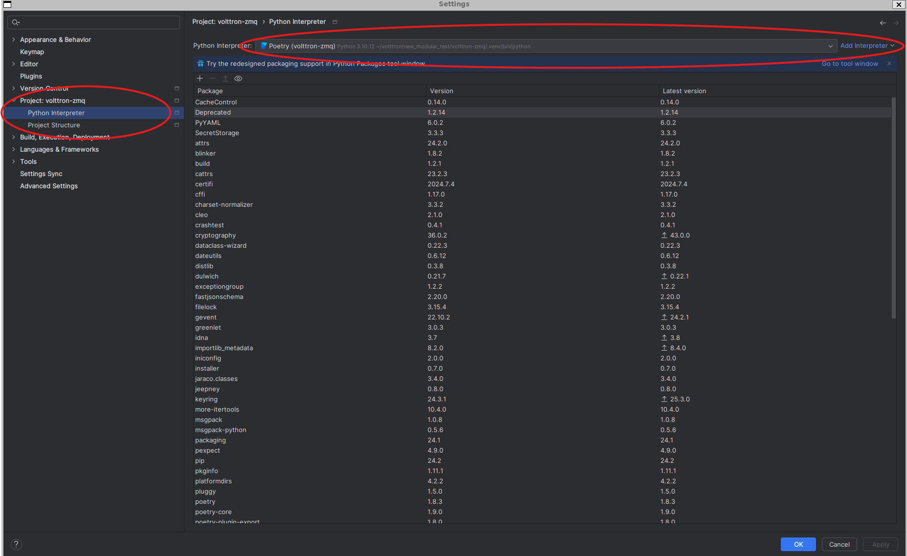
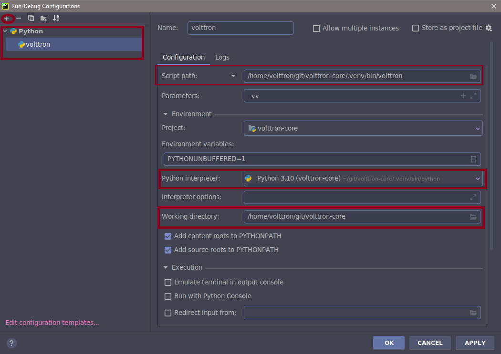

.. _Pycharm-Dev-Environment:

===============================
Pycharm Development Environment
===============================

Pycharm is an IDE dedicated to developing python projects. It provides coding
assistance and easy access to debugging tools as well as integration with
py.test. It is a popular tool for working with VOLTTRON.
Jetbrains provides a free community version that can be downloaded from
https://www.jetbrains.com/pycharm/

Open Pycharm and load volttron-core
------------------------------

Pycharm Setup
==============

When launching Pycharm for the first time we have to tell it where to find the
volttron-core source code. If you have already cloned the repo then point Pycharm to
the cloned project.

Subsequent instances of Pycharm will automatically load the VOLTTRON project.

.. note::

   When getting started make sure to search for `gevent` in the settings and
   ensure that support for it is enabled.

|Load Volttron|

Set the Project Interpreter
---------------------------

This step should be completed after running ``poetry install`` on your volttron-core source root.
Pycharm needs to know which python environment it should use
when running and debugging code. This also tells Pycharm where to find python
dependencies. Settings menu can be found under the File option in Pycharm.

|Set Project Interpreter|

Running the VOLTTRON Process
----------------------------

If you are not interested in running the VOLTTRON process itself in Pycharm then
this step can be skipped.

In **Run > Edit Configurations** create a configuration that has
`<your source dir>/.venv/bin/volttron` in the script field, `-vv` in the script
parameters field (to turn on verbose logging), and set the working directory to
the top level source directory.

|Run Settings|

VOLTTRON can then be run from the Run menu or as shown in the image below

|Run Volttron|

Result

|Run Volttron Result|

.. |Run Volttron| image:: files/04_run_volttron.png
.. |Run Volttron Result| image:: files/05_run_volttron_result.png

