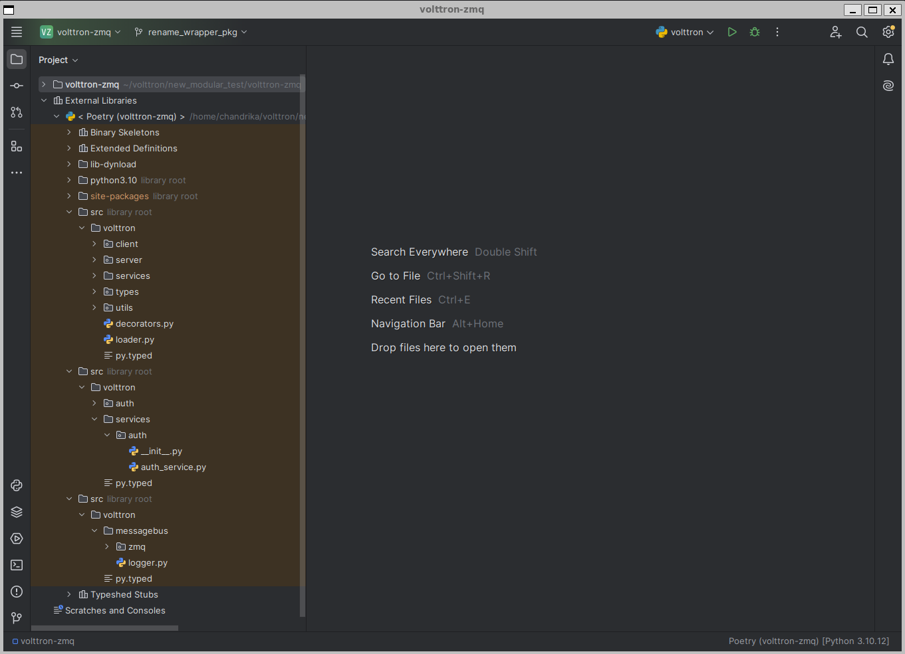
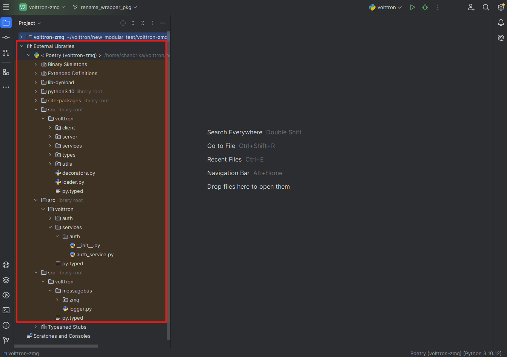
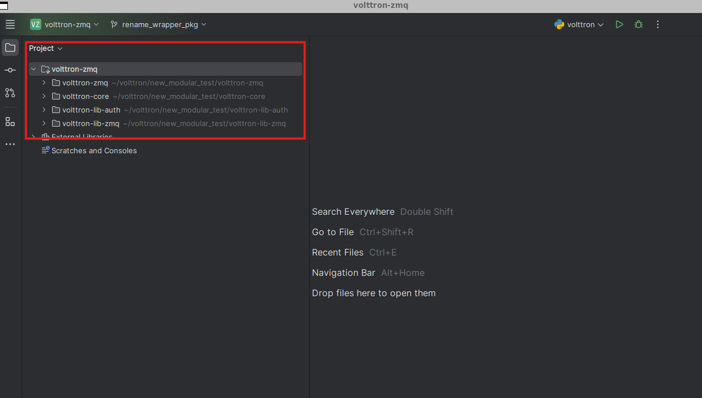
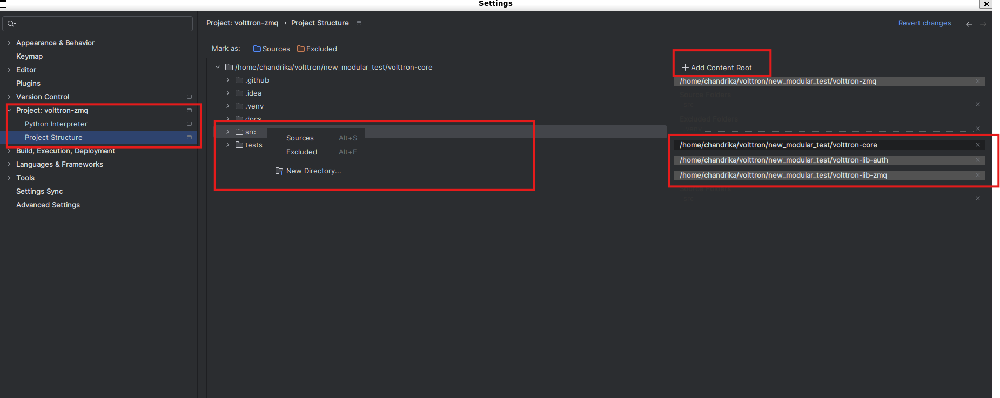
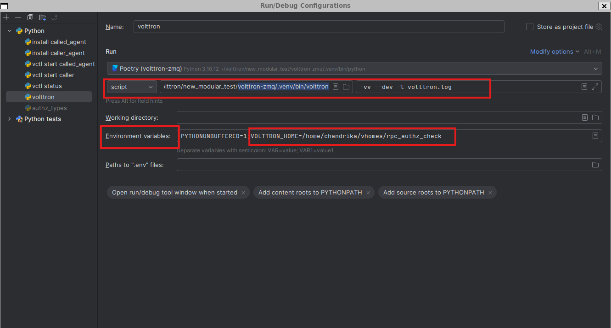
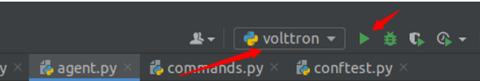
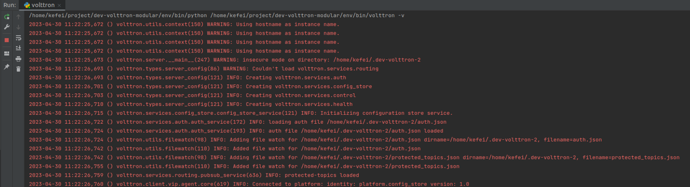

.. _Pycharm-Dev-Environment:

===============================
Pycharm Development Environment
===============================

Before you can setup pycharm development environment, you need

  1. A Linux environment with pre-requisite softwares. Please refer to :ref:`Install virtual machine <Install-VM>`
     or :ref:`WSL2 Ubuntu environment <Install-WSL2-Ubuntu>` to setup one
  2. Your own fork of relevant volttron repositories cloned in your Linux environment.
     Please refer to :ref:`this doc for details<Fork-Repository>`

Pycharm is an IDE dedicated to developing python projects. It provides coding
assistance and easy access to debugging tools as well as integration with
py.test. It is a popular tool for working with VOLTTRON.
Jetbrains provides a free community version that can be downloaded from
https://www.jetbrains.com/pycharm/

Install Pycharm
================
Pycharm can be installed two ways
  1. Installed within the Ubuntu environment so it access code local to it and renders UI using a X Server.
  2. Install on Windows host and set it up to connect to remote code in Ubuntu wsl environment. For the VOLTTRON 
     use case, only Pycharm professional version would work for this type of install. This is because, Pycharm
     community edition would not allow you to point to a python interpreter within a virtual environment in the 
     community

Installing pycharm-community on Ubuntu-22
~~~~~~~~~~~~~~~~~~~~~~~~~~~~~~~~~~~~~~~~~
Run the following commands to get the pre-requisites for installing and running pycharm

 - ``sudo apt-get install firefox``  (To download pycharm-community tar installer. Or you could download on windows and
   copy it into Ubuntu)
 - run the command ``firefox`` to launch browser from Ubuntu, go to
   `pycharm download page <https://jetbrains.com/pycharm/download>` and download pycharm (community/professional) for
   Linux
 - Untar pycharm tar file in a easy to access location say $HOME/pycharm
 - Install the following dependencies for pycharm

   .. code-block:: bash

        sudo apt-get install libxrender1
        sudo apt-get install libxtst6
        sudo apt-get install libxi6
        sudo apt install libfreetype6-dev

 - Optional: create an alias in ~/.bashrc that points to <pycharm untar dir>/bin/pycharm. Example:
   ``alias pycharm='/home/user1/pycharm-community-2024.2/bin/pycharm 1>/dev/null 2>&1 &'``

Installing pycharm professional on Windows and opening remote code
~~~~~~~~~~~~~~~~~~~~~~~~~~~~~~~~~~~~~~~~~~~~~~~~~~~~~~~~~~~~~~~~~~

TODO: Riley ?

Pycharm Settings/Configurations
===============================

When launching Pycharm for the first time we have to tell it where to find the
volttron-zmq source code. If you have already cloned the repo then point Pycharm to
the cloned project.

Subsequent instances of Pycharm will automatically load the VOLTTRON project.

.. note::

   When getting started make sure to search for `gevent` in the settings and
   ensure that support for it is enabled.

|Load Volttron|

Set the Project Interpreter
---------------------------

If you have already ran ``poetry install --no-root`` on your cloned volttron-zmq source directory, on opening the
volttron-zmq project in pycharm, pycharm should automatically detect this project as a poetry project and set the
python interpreter for this project as "<volttron-zmq clone dir>/.venv/bin/python".

If you did not run **poetry install** on command line already, run this on command line to create a poetry environment,
and then manually set the python interpreter path in pycharm. Pycharm needs this information to know which python
environment it should use for running/debugging code and where to find dependencies.

You can set or verify the python interpreter path by going to the Settings menu under the File option in Pycharm.

|Set Project Interpreter|

Once the python interpreter is set, pycharm will automatically show all the source code dependencies in pyproject.toml
under External libraries. In the screenshot below you can see three "src" folders listed under external. This is because
the example volttron-zmq repository used for this screenshot, had dependencies to volttron-core, volttron-lib-auth, and
volttron-lib-zmq with all three dependencies pointing to the cloned source directories instead of pypi package

|External dependencies|

You could also explicitly add these source folders into pycharm so that they show up at the same level as volttron-zmq
source as shown in the below image. This make it easier to indentify the repository to which the "src" folder belong.

|External src folder at volttron-zmq src level|

To achieve the above, go to File -> Settings -> Project: volttron-zmq -> Project structure. Click on the
"Add Content Root" and select the path to the cloned volttron-core, then right click on the "src" folder of
volttron-core and select "Sources" to mark it as source dir. Repeat the same for volttron-lib-auth and volttron-lib-zmq

|External dependencies as explicit content root|

Running the VOLTTRON Process
----------------------------

If you are not interested in running the VOLTTRON process itself in Pycharm then
this step can be skipped.

In **Run > Edit Configurations** create a configuration that has
`<your source dir>/.venv/bin/volttron` in the script field and `--dev` in the script
parameters field. You can append other optional parameters in the script parameter field after --dev. Set the working
directory to the volttron-zmq directory.

.. note::

   If you are using a VOLTTRON_HOME folder other than the default <user home dir>/.volttron make sure VOLTTRON_HOME
   environment variable is also set

|Run Settings|

VOLTTRON can then be run from the Run menu or as shown in the image below

|Run Volttron|

Result

|Run Volttron Result|

Similarly you can create run configurations for **vctl status**, **vctl install** etc.

.. |Set Project Interpreter| image:: files/02_set_project_interpreter.png

